#

## Spring in Action 4th

The Spring Framework was created with a very specific goal in mind—to make developing Java EE applications easier.

Spring does a lot of things. But underneath all of the fantastic functionality it adds to enterprise development, its primary features are dependency injection (DI) and aspect-oriented programming (AOP).

### 1. Springing into action

a good idea of the types of problems Spring solves: 

- Simplifying Java development
  - Lightweight and minimally invasive development with POJOs
  - Loose coupling through DI and interface orientation. Coupling is a two-headed beast. On the one hand, tightly 
    coupled code is difficult to test, difficult to reuse, and difficult to understand, and it typically exhibits 
    “whack-amole” bug behavior (fixing one bug results in the creation of one or more new bugs). With DI, objects 
    are given their dependencies at creation time by some third party that coordinates each object in the system.
  - Declarative programming through aspects and common conventions: Although DI makes it possible to tie software 
    components together loosely, aspect oriented programming (AOP) enables you to capture functionality that’s used
    throughout your application in reusable components. AOP is often defined as a technique that promotes separation of concerns in a software system.
  - Eliminating boilerplate code with aspects and templates: ex JDBC (create connection, create a statement, query 
    for the result), JMS code; Spring’s JdbcTemplate makes it possible to perform database operations without all
    the ceremony required by traditional JDBC.  

- Containing your bean
  - the container creates the objects, wires them together, configures them, and manages their complete lifecycle 
    from cradle to grave
  - Spring comes with several container that can be categorized into two distinct types: 
    - Bean factories are the simplest of containers, providing basic support for DI.  
    - Application contexts build on the notion of a bean factory by providing application-framework services, such as the ability to resolve textual messages from a properties file and the ability to publish application events to interested event listeners.
  - A bean’s life: 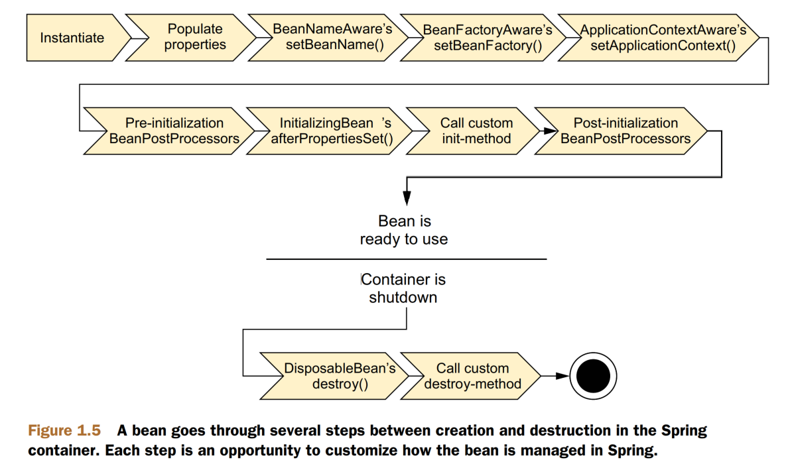

- Surveying the Spring landscape: These modules can be arranged into six categories of functionality
  - 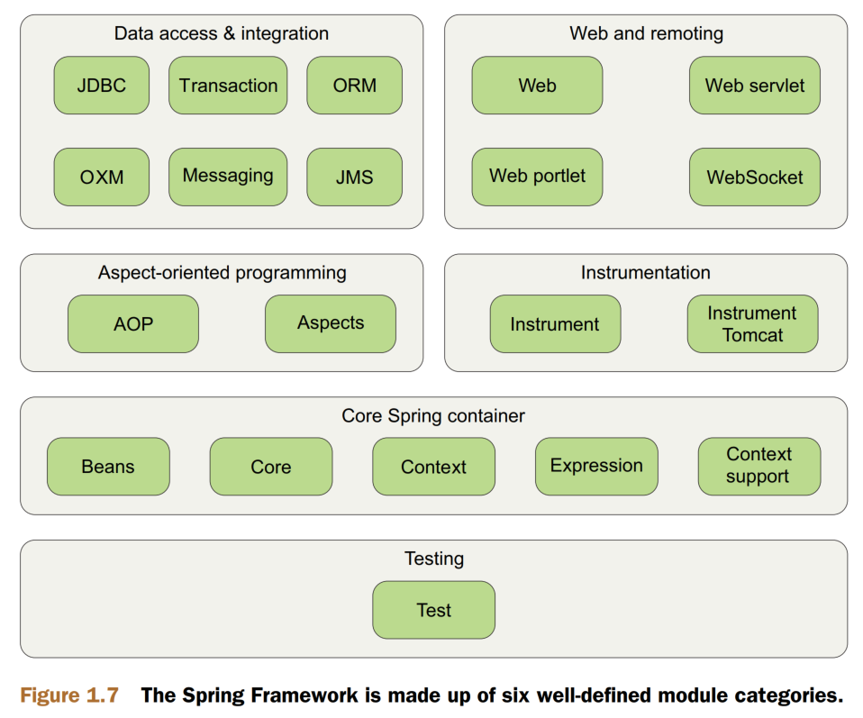
  - The whole Spring portfolio includes several frameworks and libraries that build on the core Spring Framework and 
    on each other: SPRING WEB FLOW, SPRING WEB SERVICES, SPRING SECURITY, SPRING INTEGRATION, SPRING BATCH, SPRING 
    DATA, SPRING SOCIAL, SPRING MOBILE, SPRING FOR ANDROID, SPRING BOOT

### 2. Wiring beans

Spring is incredibly flexible, offering three primary wiring mechanisms:
 Explicit configuration in XML
 Explicit configuration in Java
 Implicit bean discovery and automatic wiring

#### Automatically wiring beans:

Spring attacks automatic wiring from two angles:
 Component scanning—Spring automatically discovers beans to be created in the
application context.
 Autowiring—Spring automatically satisfies bean dependencies.

@Component annotation identifies this class as a component class and serves as a clue to Spring that a 
bean should be created for the class

@ComponentScan to enable component scanning in Spring; With no further configuration, it will default to scanning the 
same package as the configuration class. Spring will scan that package and any subpackages underneath it, looking 
for classes that are annotated with @Component. If you’d rather turn on component scanning via XML configuration, then you can use the <context:component-scan> element from Spring’s context namespace.

Naming a component-scanned bean:
- default: lowercasing the first letter of the class name
- config: annotate the class with @Component("name-config") or jakarta.inject.Named("name-config")

Setting a base package for component scanning:
- @ComponentScan("soundsystem")
- @ComponentScan(basePackages="soundsystem")
- @ComponentScan(basePackages={"soundsystem", "video"})
- @ComponentScan(basePackageClasses={CDPlayer.class, DVDPlayer.class}). 


Annotating beans to be automatically wired:you can use Spring’s @Autowired annotation.
- Whether it’s a constructor, a setter method, or any other method, Spring will attempt to satisfy the dependency 
  expressed in the method’s parameters. If there are no matching beans, Spring will throw an exception as the 
  application context is being created. To avoid that exception, you can set the required attribute on @Autowired to 
  false
- @Autowired is a Spring-specific annotation. If it troubles you to be scattering Spring-specific annotations 
  throughout your code for autowiring, you might consider using the @Inject annotation instead

#### Wiring beans with Java

Although automatic Spring configuration with component scanning and automatic wiring is preferable in many cases, 
there are times when automatic configuration isn’t an option and you must configure Spring explicitly. For instance, 
let’s say that you want to wire components from some third-party library into your application.  In that case, you 
must turn to explicit configuration: Java and XML

JavaConfig is the preferred option for explicit configuration because it’s more powerful, type-safe, and refactor-friendly.

The key to creating a JavaConfig class is to annotate it with @Configuration.The @Configuration annotation 
identifies this as a configuration class, and it’s expected to contain details on beans that are to be created in 
the Spring application context

#### Wiring beans with XML

#### Importing and mixing configurations


### 3. Advanced wiring

#### Environments and profiles

Certain environment-specific choices made for development aren’t appropriate or won’t work when the application 
transitions from development to production. Database configuration, encryption algorithms, and integration with 
external systems are just a few examples of things that are likely to vary across deployment environments.

One way of doing this is to configure each bean in a separate configuration class
(or XML file) and then make a build-time decision (perhaps using Maven profiles)
about which to compile into the deployable application. The problem with this solution is that it requires that the application be rebuilt for each environment. A rebuild
might not be that big a problem when going from development to QA. But requiring a
rebuild between QA and production has the potential to introduce bugs and cause an
epidemic of ulcers among the members of your QA team.

Fortunately, Spring has a solution that doesn’t require a rebuild.

Configuring profile beans: Spring waits to
make the decision at runtime. Consequently, the same deployment unit (perhaps a
WAR file) will work in all environments without being rebuilt. 

In Java configuration, you can use the @Profile annotation to specify which profile a bean belongs to or you can CONFIGURING PROFILES IN XML

Spring honors two separate properties when determining which profiles are active:
spring.profiles.active and spring.profiles.default. If spring.profiles.active
is set, then its value determines which profiles are active. But if spring
.profiles.active isn’t set, then Spring looks to spring.profiles.default. If neither
spring.profiles.active nor spring.profiles.default is set, then there are no
active profiles, and only those beans that aren’t defined as being in a profile are created.

There are several ways to set these properties:
 As initialization parameters on DispatcherServlet
 As context parameters of a web application
 As JNDI entries
 As environment variables
 As JVM system properties
 Using the @ActiveProfiles annotation on an integration test class

#### Addressing ambiguity in autowiring

You can declare one of the candidate beans as the primary choice, or you can
use qualifiers to help Spring narrow its choices to a single candidate.

- Designating a primary bean: @Primary
- Qualifying autowired beans: @Qualifier can be applied alongside @Autowired or @Inject at the point of injection to specify which bean you want to be injected.

### Scoping beans

By default, all beans created in the Spring application context are created as singletons.

But sometimes you may find yourself working with a mutable class that does maintain some state and therefore isn’t 
safe for reuse. In that case, declaring the class as a singleton bean probably isn’t a good idea because that object can be tainted and create unexpected problems when reused later

Spring defines several scopes under which a bean can be created, including the
following:
 Singleton—One instance of the bean is created for the entire application.
 Prototype—One instance of the bean is created every time the bean is injected
into or retrieved from the Spring application context.
 Session—In a web application, one instance of the bean is created for each session.
 Request—In a web application, one instance of the bean is created for each
request.

To select an alternative type, you can use the @Scope annotation, either in conjunction with the @Component 
annotation or with the @Bean annotation. And, in the event that you’re configuring the bean in XML, you can set the 
scope using the scope attribute of the <bean> element


Working with request and session scope: For instance, in a typical e-commerce application,
you may have a bean that represents the user’s shopping cart. If the shopping cart
bean is a singleton, then all users will be adding products to the same cart. On the
other hand, if the shopping cart is prototype-scoped, then products added to the cart
in one area of the application may not be available in another part of the application
where a different prototype-scoped shopping cart was injected. 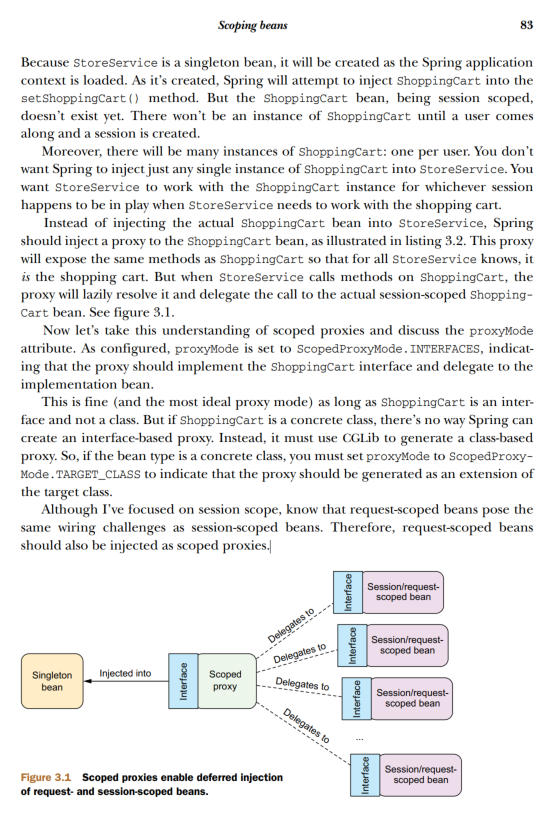

#### Runtime value injection

Spring offers two ways of evaluating values at runtime:
 Property placeholders
 The Spring Expression Language (SpEL)


### Aspect-oriented Spring

As stated earlier, aspects help to modularize cross-cutting concerns. In short, a crosscutting concern can be described as any functionality that affects multiple points of an
application.

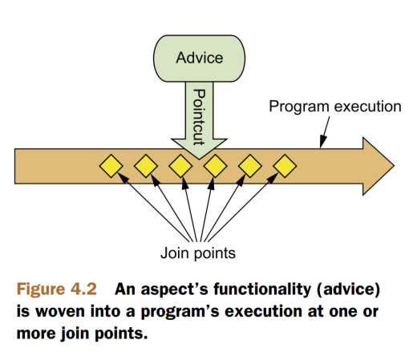

- aspects have a purpose—a job they’re meant to do. In AOP terms, the job of an aspect is called **advice**. Advice 
  defines both the what and the when of an aspect. Spring aspects can work with five kinds of advice:  Before—The advice functionality takes place before the advised method is
  invoked.
   After—The advice functionality takes place after the advised method completes,
  regardless of the outcome.
   After-returning—The advice functionality takes place after the advised method
  successfully completes.
   After-throwing—The advice functionality takes place after the advised method
  throws an exception.
   Around—The advice wraps the advised method, providing some functionality
  before and after the advised method is invoked.
- A **join point** is a point in
  the execution of the application where an aspect can be plugged in. This point could
  be a method being called, an exception being thrown, or even a field being modified.
  These are the points where your aspect’s code can be inserted into the normal flow of
  your application to add new behavior.
- **Pointcuts** help narrow down the join points advised by an aspect. If advice defines the what and when of aspects, 
  then pointcuts define the where.
- An **aspect** is the merger of **advice** and **pointcuts**.
- An **introduction** allows you to add new methods or attributes to existing classes.
- **Weaving** is the process of applying aspects to a target object to create a new proxied
  object.

Spring’s support for AOP comes in four styles:
 Classic Spring proxy-based AOP
 Pure-POJO aspects
 @AspectJ annotation-driven aspects
 Injected AspectJ aspects (available in all versions of Spring)

a few key points of Spring’s AOP framework:
- SPRING ADVICE IS WRITTEN IN JAVA
- SPRING ADVISES OBJECTS AT RUNTIME
- SPRING ONLY SUPPORTS METHOD JOIN POINTS

### Building Spring web applications

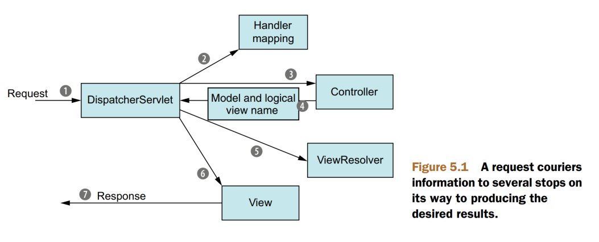

1. The first stop in the request’s travels is at Spring’s DispatcherServlet.  A front controller is a common web 
application pattern where a single servlet delegates responsibility for a request to other components of an application to perform actual processing.

2. a typical application may have several controllers, and DispatcherServlet needs some help deciding   which controller to send the request to. So the DispatcherServlet consults one or more handler mappings to figure    out where the request’s next stop will be.
3. DispatcherServlet sends the request on its merry way to the chosen controller. At the controller, the request   drops off its payload (the information submitted by the user) and patiently waits while the controller processes    that information. The logic performed by a controller often results in some information that needs   to be carried back to the user and displayed in the browser. This information is   referred to as the **model**. 
4. One of the last things a controller does is package up the model data and identify   the name of a view that should render the output. It then sends the request, along   with the model and view name, back to the DispatcherServlet
5. The DispatcherServlet consults a view resolver to map the logical view name to a specific view implementation
6. Now that DispatcherServlet knows which view will render the result, the request’s job is almost over. Its final   stop is at the view implementation. The view will   use the model data to render output that will be carried back to the client by the (notso-hardworking) response   object (7).

#### Setting up Spring MVC

CONFIGURING DISPATCHERSERVLET: DispatcherServlet is the centerpiece of Spring MVC.

-  any class that extends AbstractAnnotationConfigDispatcherServletInitializer will automatically be used to 
   configure DispatcherServlet and the Spring application context in the application’s servlet context.
- **getServletMappings()**, identifies one or more paths that DispatcherServlet will be mapped to. In this case,  it’s mapped to /, indicating that it  will be the application’s default servlet. It will handle all requests coming into the  application.
- When DispatcherServlet starts up, it creates a Spring application context and starts  loading it with beans declared in the configuration files or classes that it’s given. With  the **getServletConfigClasses()** method in listing 5.1, you’ve asked that DispatcherServlet load its application context with beans defined in the WebConfig configuration class (using Java configuration).
- But in Spring web applications, there’s often another application context. This other application context is  created by ContextLoaderListener. Whereas DispatcherServlet is expected to load beans containing web components  such as controllers, view resolvers, and handler mappings, ContextLoaderListener is  expected to load the other beans in your application. These beans are typically the  middle-tier and data-tier components that drive the back end of the application. The @Configuration  classes returned from getServletConfigClasses() will define beans for DispatcherServlet’s application context. Meanwhile, the @Configuration class’s returned getRootConfigClasses() will be used to configure the application context created by  ContextLoaderListener. In this case, your root configuration is defined in RootConfig, whereas DispatcherServlet’s configuration is declared in WebConfig.

If you’re not yet working with a Servlet 3.0-capable server, then configuring↵DispatcherServlet in a subclass of AbstractAnnotationConfigDispatcherServletInitializer won’t work for you. You’ll have no choice but to configure DispatcherServlet in web.xml. We’ll look at web.xml and other configuration options in↵chapter 7. For now, though, let’s look at WebConfig and RootConfig, the two configuration classes referred to in listing 5.1, and see how to enable Spring MVC.

ENABLING SPRING MVC: @Configuration vs @EnableWebMvc
- No view resolver is configured.
- Component-scanning isn’t enabled.
- As it is, DispatcherServlet is mapped as the default servlet for the application  and will handle all requests, including requests for static resources, such as  images and stylesheets (which is probably not what you want in most cases)

Therefore, you need to add a bit more configuration in WebConfig on top of this bare minimum Spring MVC configuration to make it useful.

## Spring in Action 6th

### Getting started with Spring

At its core, Spring offers a container, often referred to as the Spring application context, that creates and manages application components. These components, or beans,
are wired together inside the Spring application context to make a complete application, much like bricks, mortar, timber, nails, plumbing, and wiring are bound together
to make a house.

The act of wiring beans together is based on a pattern known as dependency injection
(DI). . This is done typically through constructor arguments or property
accessor methods

Spring Boot is an extension
of the Spring Framework that offers several productivity enhancements. The most well
known of these enhancements is autoconfiguration, where Spring Boot can make reasonable guesses at what components need to be configured and wired together, based
on entries in the classpath, environment variables, and other factors.


@SpringBootApplication is a composite annotation that combines the following three annotations:
- @SpringBootConfiguration: a specialized form of the @Configuration annotation
- @EnableAutoConfiguration—Enables Spring Boot automatic configuration
- @ComponentScan—Enables component scanning.

Spring Boot DevTools:
 Automatic application restart when code changes
 Automatic browser refresh when browser-destined resources (such as templates, JavaScript, stylesheets, and so on) 
change
 Automatic disabling of template caches
 Built in H2 Console, if the H2 database is in use

Summary
 Spring aims to make developer challenges easy, like creating web applications,
working with databases, securing applications, and microservices.
 Spring Boot builds on top of Spring to make Spring even easier with simplified
dependency management, automatic configuration, and runtime insights.

### 2. Developing web application

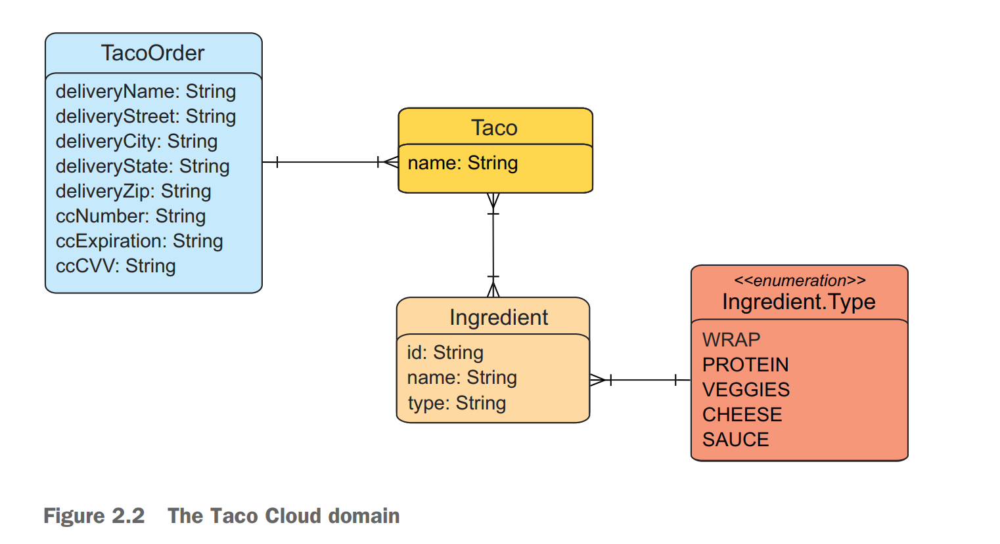
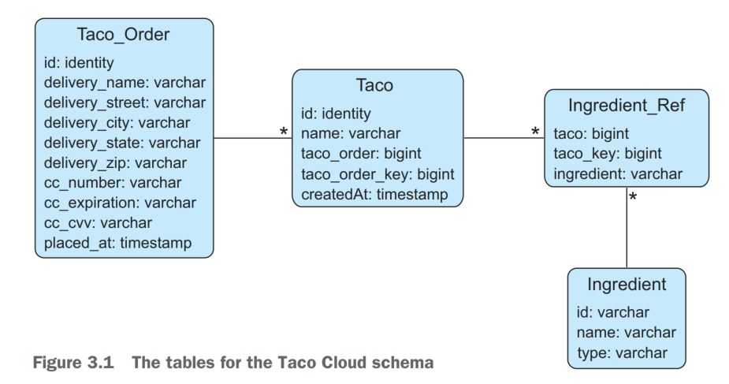

Lombok automatically generate those methods at compile time so that they will be available at run time. In fact, the 
@Data annotation at the class level is provided by Lombok and tells Lombok to generate all of those missing methods 
(the usual set of getter and setter methods, not to mention useful methods like equals(), hashCode(), toString(), 
and others) as well as a constructor that accepts all final properties as arguments.

Lombok’s magic is applied at compile time, so there’s no need for it to be available at run time. Excluding it like 
this keeps it out of the resulting JAR or WAR file.

@Slf4j, is a Lombok-provided annotation that, at compilation time, will automatically generate an SLF4J (Simple 
Logging Facade for Java, https://www.slf4j.org/) Logger static property in the class.

@ModelAttribute: create only a new object to place into the model.

@SessionAttributes:  indicates that the TacoOrder object that is put into the model a
little later in the class should be maintained in session. holds state for the order being built as
the user creates tacos across multiple requests.

A converter is any class that implements
Spring’s Converter interface and implements its convert() method to take one
value and convert it to another

### 3. Working with data

When persisting objects to a database, it’s generally a good idea to have one field that
uniquely identifies the object.

@Repository: If there is more
than one constructor, or if you just want autowiring to be explicitly stated, then you
can annotate the constructor with @Autowired

When you save a TacoOrder, you also must
save the Taco objects that go with it. And when you save the Taco objects, you’ll also
need to save an object that represents the link between the Taco and each Ingredient
that makes up the taco. Another thing that the save() method will need to do is determine what ID is
assigned to the order once it has been saved. Per the schema, the id property on the
Taco_Order table is an identity, meaning that the database will determine the value
automatically. But if the database determines the value for you, then you will need to
know what that value is so that it can be returned in the TacoOrder object returned
from the save() method. Fortunately, Spring offers a helpful GeneratedKeyHolder
type that can help with that.

Working with JdbcTemplate:

```
<dependency>
<groupId>org.springframework.boot</groupId>
<artifactId>spring-boot-starter-jdbc</artifactId>
</dependency>
```

- First, you create a PreparedStatementCreatorFactory that describes the insert query along with the types of the query’s
  input fields. Because you’ll later need to fetch the saved order’s ID, you also will need
  to call setReturnGeneratedKeys(true).
- you use it to create a
  PreparedStatementCreator, passing in the values from the TacoOrder object that will be persisted.
- save the order data by calling the update() method on JdbcTemplate, passing in the
  PreparedStatementCreator and a GeneratedKeyHolder. After the order data has
  been saved, the GeneratedKeyHolder will contain the value of the id field as assigned
  by the database and should be copied into the TacoOrder object’s id property

#### Working with Spring Data JDBC

The Spring Data project is a rather large umbrella project comprising several subprojects, most of which are focused on data persistence with a variety of different database
types. A few of the most popular Spring Data projects include these:
 Spring Data JDBC—JDBC persistence against a relational database
 Spring Data JPA—JPA persistence against a relational database
 Spring Data MongoDB—Persistence to a Mongo document database
 Spring Data Neo4j—Persistence to a Neo4j graph database
 Spring Data Redis—Persistence to a Redis key-value store
 Spring Data Cassandra—Persistence to a Cassandra column store database

One of the most interesting and useful features provided by Spring Data for all of
these projects is the ability to automatically create repositories, based on a repository
specification interface.


Spring Data will automatically generate implementations for our repository interfaces at run time. But it will do that only for interfaces that extend one of the repository interfaces provided by Spring Data.

Although IngredientRepository will work as shown here by extending Repository,
Spring Data also offers CrudRepository as a base interface for common operations,
including the three methods we’ve defined in IngredientRepository.

Spring Data automatically generates an implementation on the fly. This means the repositories are ready to
use from the get-go. Just inject them into the controllers and you’re done

The only other thing we’ll need to do is annotate our domain classes so that Spring
Data JDBC will know how to persist them.Generally speaking, this means annotating
the identity properties with @Id—so that Spring Data will know which field represents
the object’s identity—and optionally annotating the class with @Table.

Spring Boot offers two useful interfaces for executing logic when an application
starts up: CommandLineRunner and ApplicationRunner. The key difference between CommandLineRunner and 
ApplicationRunner is in the
parameter passed to the respective run() methods. CommandLineRunner accepts a
String vararg, which is a raw representation of arguments passed on the command
line. But ApplicationRunner accepts an ApplicationArguments parameter that offers
methods for accessing the arguments as parsed components of the command line.


#### Persisting data with Spring Data JPA

Whereas Spring Data JDBC makes easy work of persisting data, the Java Persistence
API (JPA) is another popular option for working with data in a relational database.
Spring Data JPA offers an approach to persistence with JPA similar to what Spring
Data JDBC gave us for JDBC.

Spring Data JPA is available to Spring Boot applications with the JPA starter. This
starter dependency not only brings in Spring Data JPA but also transitively includes
Hibernate as the JPA implementation.  If you want to use a different JPA implementation, then you’ll need to, at least,
exclude the Hibernate dependency and include the JPA library of your choice. For example, to use EclipseLink instead of Hibernate,

To declare this as a JPA entity, Ingredient must be annotated with @Entity. And its id
property must be annotated with @Id to designate it as the property that will uniquely
identify the entity in the database. Note that this @Id annotation is the JPA variety
from the javax.persistence package, as opposed to the @Id provided by Spring Data
in the org.springframework.data.annotation package.

In addition to the JPA-specific annotations, you’ll also note that you’ve added a
@NoArgsConstructor annotation at the class level. JPA requires that entities have
a no-arguments constructor, so Lombok’s @NoArgsConstructor does that for you.
You don’t want to be able to use it, though, so you make it private by setting the
access attribute to AccessLevel.PRIVATE. And because you must set final properties, you also set the force attribute to true, which results in the Lombok-generated
constructor setting them to a default value of null, 0, or false, depending on the
property type.

You also will add an @AllArgsConstructor to make it easy to create an Ingredient
object with all properties initialized.

You also need a @RequiredArgsConstructor. The @Data annotation implicitly
adds a required arguments constructor, but when a @NoArgsConstructor is used,
that constructor is removed. An explicit @RequiredArgsConstructor ensures that
you’ll still have a required arguments constructor, in addition to the private noarguments constructor.

Because you’re relying on the database to automatically generate the ID value, you also annotate the id property with @GeneratedValue,
specifying a strategy of AUTO.

To declare the relationship between a Taco and its associated Ingredient list, you
annotate ingredients with @ManyToMany. A Taco can have many Ingredient objects,
and an Ingredient can be a part of many Tacos.

### Working with nonrelational data

#### Working with Cassandra repositories

```shell
<dependency>
<groupId>org.springframework.boot</groupId>
<artifactId>spring-boot-starter-data-cassandra</artifactId>
</dependency>
```

Cassandra is a distributed, high-performance, always available, eventually consistent,
partitioned-column-store, NoSQL database.


Although annotations provided by the JPA specification won’t work for Cassandra persistence, Spring Data Cassandra provides its
own set of mapping annotations for a similar purpose.

@Table

@PrimaryKey

@PrimaryKeyColumn with a
type of PrimaryKeyType.PARTITIONED. This specifies that the id property serves as
the partition key, used to determine to which Cassandra partition(s) each row of taco
data will be written

@PrimaryKeyColumn is set
to PrimaryKeyType.CLUSTERED, which designates the createdAt property as a clustering key. As mentioned earlier, clustering keys are used to determine the ordering of
rows within a partition.

columns that contain collections of data, such
as the ingredients column, must be collections of native types (integers, strings, and
so on) or user-defined types.

In Cassandra, user-defined types enable you to declare table columns that are
richer than simple native types. Often they’re used as a denormalized analog for
relational foreign keys. In contrast to foreign keys, which only hold a reference to a
row in another table, columns with user-defined types actually carry data that may
be copied from a row in another table.

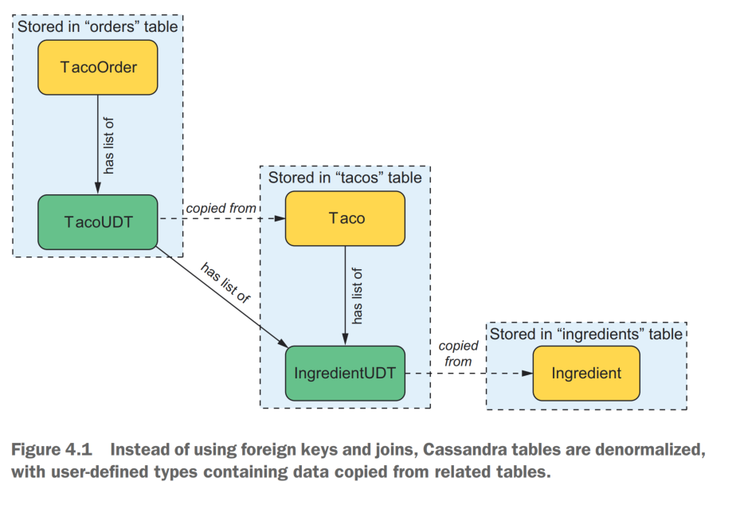

#### Writing MongoDB repositories

```shell
<dependency>
<groupId>org.springframework.boot</groupId>
<artifactId>
spring-boot-starter-data-mongodb
</artifactId>
</dependency>
```

But for convenience in testing or developing, you can choose to work with an embedded Mongo database instead. To do that, add the following Flapdoodle embedded
MongoDB dependency to your build:

```shell
<dependency>
<groupId>de.flapdoodle.embed</groupId>
<artifactId>de.flapdoodle.embed.mongo</artifactId>
<!-- <scope>test</scope> -->
</dependency>
```

 @Id—Designates a property as the document ID (from Spring Data Commons)
 @Document—Declares a domain type as a document to be persisted to MongoDB
 @Field—Specifies the field name (and, optionally, the order) for storing a
property in the persisted document
 @Transient—Specifies that a property is not to be persisted

### 5. Securing Spring


By doing nothing more than adding the security starter to the project build, you
get the following security features:
 All HTTP request paths require authentication.
 No specific roles or authorities are required.
 Authentication is prompted with a simple login page.
 There’s only one user; the username is user.

handful of password encoders provided by Spring Security,
 BCryptPasswordEncoder—Applies bcrypt strong hashing encryption
 NoOpPasswordEncoder—Applies no encoding
 Pbkdf2PasswordEncoder—Applies PBKDF2 encryption
 SCryptPasswordEncoder—Applies Scrypt hashing encryption
 StandardPasswordEncoder—Applies SHA-256 hashing encryption

No matter which password encoder you use, it’s important to understand that the
password in the database is never decoded. Instead, the password that the user enters
at login is encoded using the same algorithm, and it’s then compared with the encoded
password in the database. That comparison is performed in the PasswordEncoder’s
matches() method

We’ll start by configuring a user store that can handle more than one user.To configure a user store for authentication purposes, you’ll need to declare a
UserDetailsService bean. The loadUserByUsername() method accepts a username and uses it to look up a
UserDetails object. If no user can be found for the given username, then it will throw
a UsernameNotFoundException. , Spring Security offers several out-of-the-box implementations of
UserDetailsService, including the following:
 An in-memory user store
 A JDBC user store
 An LDAP user store

To configure these security rules, we’ll need to declare a SecurityFilterChain
bean. The following @Bean method shows a minimal (but not useful) SecurityFilterChain bean declaration:
@Bean
public SecurityFilterChain filterChain(HttpSecurity http) throws Exception {
return http.build();
}

The following are among the many things you can configure with HttpSecurity:
 Requiring that certain security conditions be met before allowing a request to
be served
 Configuring a custom login page
 Enabling users to log out of the application
 Configuring cross-site request forgery protection

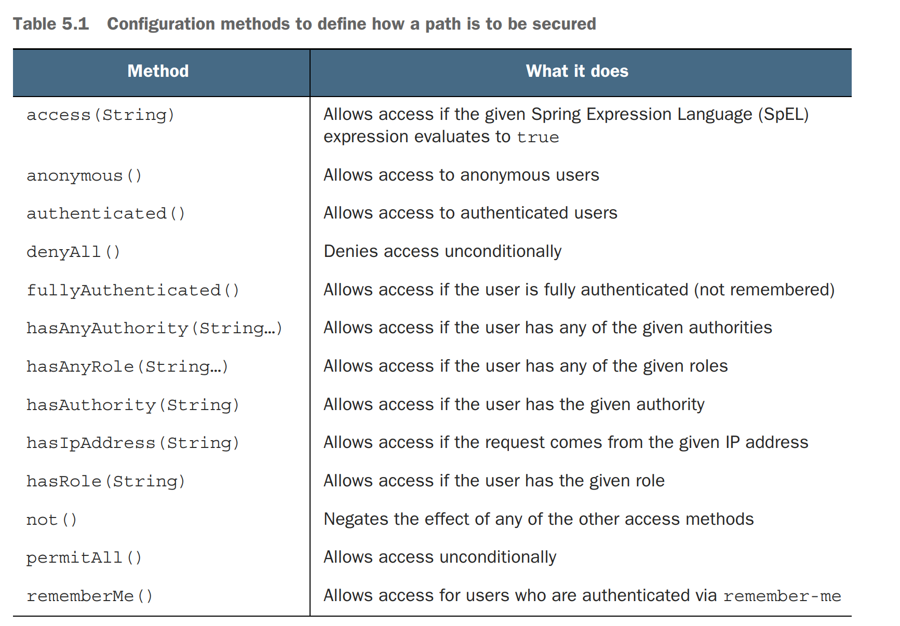


We have several ways to determine who the user is. A few of the most common
ways follow:
 Inject a java.security.Principal object into the controller method.
 Inject an org.springframework.security.core.Authentication object into
the controller method.
 Use org.springframework.security.core.context.SecurityContextHolder
to get at the security context.
 Inject an @AuthenticationPrincipal annotated method parameter.
(@AuthenticationPrincipal is from Spring Security’s org.springframework
.security.core.annotation package.)

### 6. Working with configuration properties

different (but related) kinds of configurations in Spring:

 Bean wiring—Configuration that declares application components to be created
as beans in the Spring application context and how they should be injected into
each other
 Property injection—Configuration that sets values on beans in the Spring application context


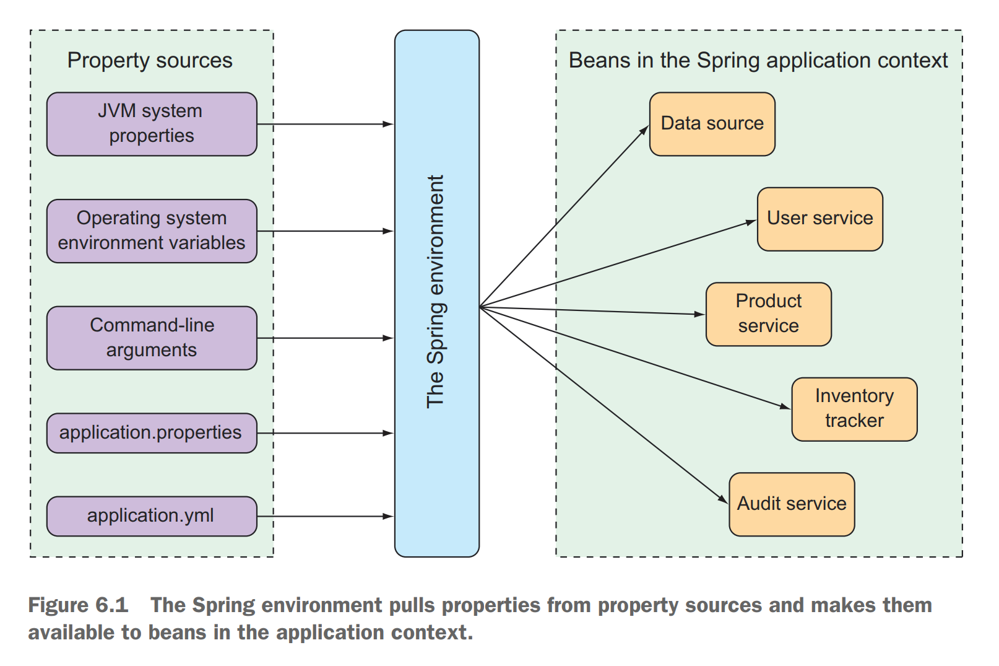

## Integrated Spring

### 7.Creating REST services

The @RestController annotation serves two purposes. First, it’s a stereotype annotation like @Controller and @Service that marks a class for discovery by component
scanning. But most relevant to the discussion of REST, the @RestController annotation tells Spring that all handler methods in the controller should have their return
value written directly to the body of the response, rather than being carried in the
model to a view for rendering. Alternatively, you could have annotated TacoController with @Controller, just
like any Spring MVC controller. But then you’d need to also annotate all of the handler methods with @ResponseBody to achieve the same result

#### Enabling data-backed services

Spring Data REST is another member of the Spring Data family that automatically
creates REST APIs for repositories created by Spring Data. By doing little more than
adding Spring Data REST to your build, you get an API with operations for each
repository interface you’ve defined.

```shell
<dependency>
<groupId>org.springframework.boot</groupId>
<artifactId>spring-boot-starter-data-rest</artifactId>
</dependency>
```

#### Consuming REST services

A Spring application can consume a REST API with the following:
 RestTemplate—A straightforward, synchronous REST client provided by the
core Spring Framework.
 Traverson—A wrapper around Spring’s RestTemplate, provided by Spring
HATEOAS, to enable a hyperlink-aware, synchronous REST client. Inspired
from a JavaScript library of the same name.
 WebClient—A reactive, asynchronous REST client.

Spring provides RestTemplate handles the ugly parts of working with raw REST. Most of the methods in table 7.2 are 
overloaded into the following three method
forms:
 One accepts a String URL specification with URL parameters specified in a
variable argument list.
 One accepts a String URL specification with URL parameters specified in a
Map<String,String>.
 One accepts a java.net.URI as the URL specification, with no support for
parameterized URLs.

### Securing REST

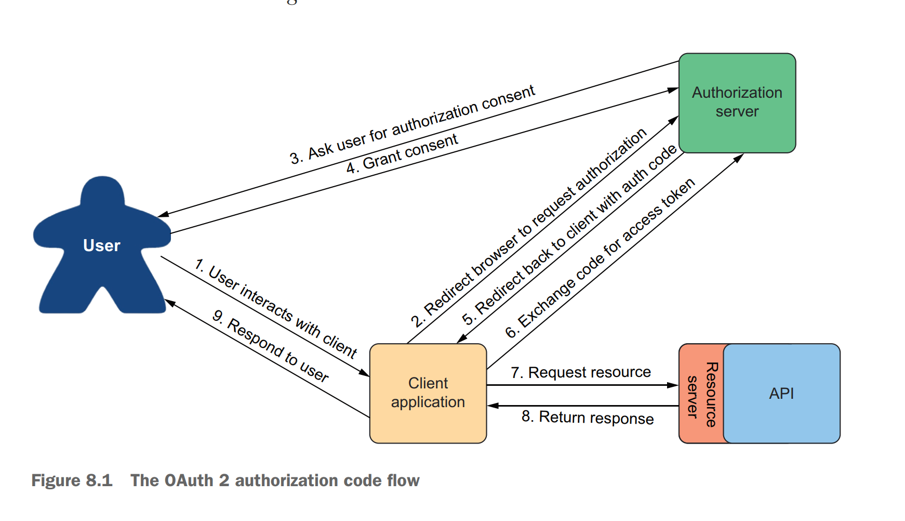


other flows supported by the
OAuth 2 specification include these:
 Implicit grant—Like authorization code grant, implicit grant redirects the user’s
browser to the authorization server to get user consent. But when redirecting
back, rather than provide an authorization code in the request, the access
token is granted implicitly in the request. Although originally designed for
JavaScript clients running in a browser, this flow is not generally recommended
anymore, and authorization code grant is preferred.
 User credentials (or password) grant—In this flow, no redirect takes place, and there
may not even be a web browser involved. Instead, the client application obtains the
user’s credentials and exchanges them directly for an access token. This flow
seems suitable for clients that are not browser based, but modern applications
often favor asking the user to go to a website in their browser and perform authorization code grant to avoid having to handle the user’s credentials.
 Client credentials grant—This flow is like user credentials grant, except that
instead of exchanging a user’s credentials for an access token, the client
exchanges its own credentials for an access token. However, the token granted
is limited in scope to performing non-user-focused operations and can’t be
used to act on behalf of a user.

, we’re going to focus on the authorization code grant flow to obtain
a JSON Web Token (JWT) access token. This will involve creating a handful of applications that work together, including the following:
 The authorization server—An authorization server’s job is to obtain permission
from a user on behalf of a client application. If the user grants permission, then
the authorization server gives an access token to the client application that it
can use to gain authenticated access to an API.
 The resource server—A resource server is just another name for an API that is
secured by OAuth 2. Although the resource server is part of the API itself, for
the sake of discussion, the two are often treated as two distinct concepts. The
resource server restricts access to its resources unless the request provides a
valid access token with the necessary permission scope. For our purposes, the
Taco Cloud API we started in chapter 7 will serve as our resource server, once
we add a bit of security configuration to it.
 The client application—The client application is an application that wants to consume an API but needs permission to do so. We’ll build a simple administrative
application for Taco Cloud to be able to add new ingredients.
 The user—This is the human who uses the client application and grants the
application permission to access the resource server’s API on their behalf.

One component that isn’t boilerplate, and thus not provided by OAuth2-
AuthorizationServerConfiguration, is the client repository. A client repository is
analogous to a user details service or user repository, except that instead of maintaining details about users, it maintains details about clients that might be asking for
authorization on behalf of users. It is defined by the RegisteredClientRepository
interface, 

In a production setting, you might write a custom implementations of RegisteredClientRepository to retrieve client details from a database or from some other source.
But out of the box, Spring Authorization Server offers an in-memory implementation
that is perfect for demonstration and testing purposes.


### 9.Sending messages asynchronously

We’ll consider three options that Spring offers for asynchronous messaging: the Java Message Service (JMS), RabbitMQ and Advanced Message Queueing Protocol (AMQP), and Apache Kafka


## Reactive Spring

### 10. Introducing Reactor

As we develop application code, we can write two styles of code—imperative and
reactive, which are described as follows:
 Imperative code is a lot like that absurd hypothetical newspaper subscription. It’s
a serial set of tasks, each running one at a time, each after the previous task.
Data is processed in bulk and can’t be handed over to the next task until the
previous task has completed its work on the bulk of data.
 Reactive code is a lot like a real newspaper subscription. A set of tasks is defined
to process data, but those tasks can run in parallel. Each task can process subsets of the data, handing it off to the next task in line while it continues to work
on another subset of the data.

Reactor is a library for reactive programming that’s part of the Spring family of projects. And because it serves as
the foundation of Spring’s support for reactive programming, it’s important that you
understand Reactor before we look at building reactive controllers and repositories
with Spring..

#### Understanding reactive programming

The idea is simple: you write code as a list of instructions to be followed, one at a
time, in the order that they’re encountered. A task is performed and the program
waits for it to complete before moving on to the next task. At each step along the
way, the data that’s to be processed must be fully available so that it can be processed
as a whole.

This is fine . . . until it isn’t. While a task is being performed—and especially if it’s
an I/O task, such as writing data to a database or fetching data from a remote server—
the thread that invoked that task is blocked, unable to do anything else until the task
completes. To put it bluntly, blocked threads are wasteful.

Most programming languages, including Java, support concurrent programming.
It’s fairly easy to fire up another thread in Java and send it on its way to perform some
work while the invoking thread carries on with something else. But although it’s easy
to create threads, those threads are likely to end up blocked themselves. Managing
concurrency in multiple threads is challenging. More threads mean more complexity

In contrast, reactive programming is functional and declarative in nature. Rather
than describe a set of steps that are to be performed sequentially, reactive programming involves describing a pipeline or stream through which data flows. Rather than
requiring the data to be available and processed as a whole, a reactive stream processes data as it becomes available. In fact, the incoming data may be endless (a constant stream of a location’s real-time temperature data, for instance).

Reactive Streams aims to provide a
standard for asynchronous stream processing with nonblocking backpressure.

the asynchronous trait of reactive programming; it’s
what enables us to perform tasks in parallel to achieve greater scalability. Backpressure
is a means by which consumers of data can avoid being overwhelmed by an overly fast
data source, by establishing limits on how much they’re willing to handle.

Java streams vs. Reactive Streams
- similarity between Java streams and Reactive Streams. To start with,
  they both have the word streams in their names. They also both provide a functional
  API for working with data. In fact, as you’ll see later when we look at Reactor, they
  even share many of the same operations.
- Java streams, however, are typically synchronous and work with a finite set of data.
  They’re essentially a means of iterating over a collection with functions.
- Reactive Streams support asynchronous processing of datasets of any size, including
  infinite datasets. They process data in real time, as it becomes available, with backpressure to avoid overwhelming their consumers.

The Reactive Streams specification can be summed up by four interface definitions:
Publisher, Subscriber, Subscription, and Processor. A Publisher produces data
that it sends to a Subscriber per a Subscription. Once a Subscriber has subscribed, it can receive events from the 
Publisher. 

A Flux represents a pipeline of zero, one, or many (potentially infinite) data items. A Mono is a specialized
reactive type that’s optimized for when the dataset is known to have no more than
one data item.

Reactor vs. RxJava (ReactiveX)
- If you’re already familiar with RxJava or ReactiveX, you may be thinking that Mono and
  Flux sound a lot like Observable and Single. In fact, they’re approximately equivalent semantically. They even offer many of the same operations.


#### Applying common reactive operations

Flux and Mono are the most essential building blocks provided by Reactor, and the
operations those two reactive types offer are the mortar that binds them together to
create pipelines through which data can flow. Flux and Mono offer more than 500
operations, which can be loosely categorized as follows:
 Creation
 Combination
 Transformation
 Logic


## Working with Spring WebFlux

Typical servlet web frameworks, such as Spring MVC, are blocking and multithreaded
in nature, using a single thread per connection. As requests are handled, a worker
thread is pulled from a thread pool to process the request. Meanwhile, the request
thread is blocked until it’s notified by the worker thread that it’s finished.

Consequently, blocking web frameworks won’t scale effectively under heavy
request volume. Latency in slow worker threads makes things even worse because it’ll
take longer for the worker thread to be returned to the pool, ready to handle another
request. In some use cases, this arrangement is perfectly acceptable. In fact, this is
largely how most web applications have been developed for well over a decade. But
times are changing

With an increasing number of clients consuming web applications, scalability is more important than ever.
Asynchronous web frameworks, in contrast, achieve higher scalability with fewer
threads—generally one per CPU core. By applying a technique known as event looping, these frameworks are able to 
handle many requests per
thread, making the per-connection cost more economical.

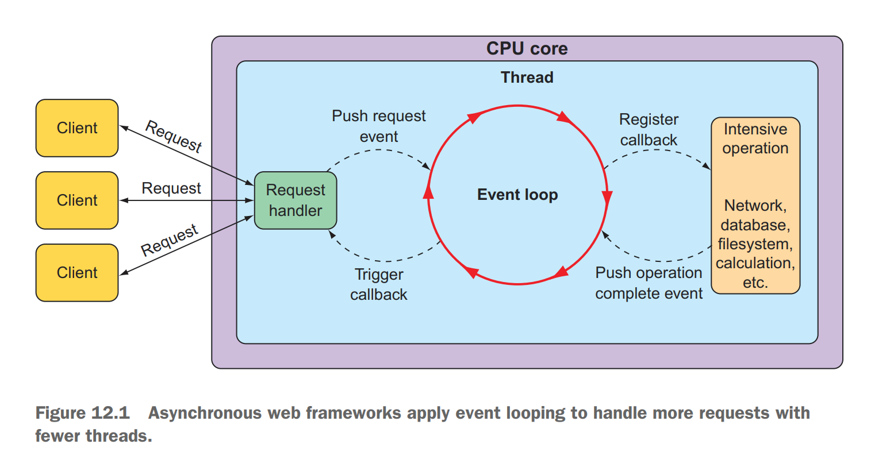

In an event loop, everything is handled as an event, including requests and callbacks
from intensive operations like database and network operations. When a costly operation is needed, the event loop registers a callback for that operation to be performed
in parallel, while it moves on to handle other events.

When the operation is complete, it’s treated as an event by the event loop, the
same as requests. As a result, asynchronous web frameworks are able to scale better
under heavy request volume with fewer threads, resulting in reduced overhead for
thread management.

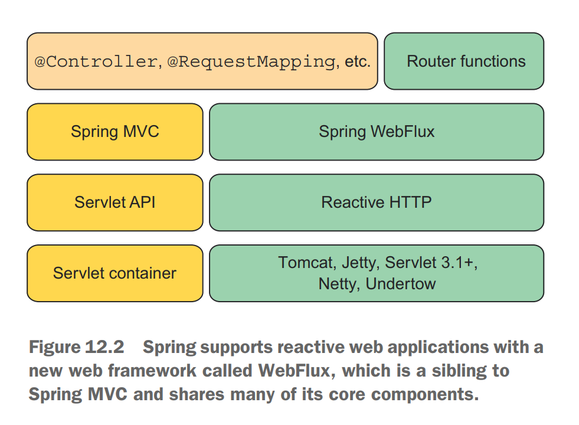

Whereas Spring WebFlux is a truly
reactive web framework, allowing for requests to be handled in an event loop, Spring
MVC is servlet-based, relying on multithreading to handle multiple requests.

## Deployed Spring

### 15.Working with Spring Boot Actuator

an actuator is a component that’s responsible for controlling and moving a mechanism. In a Spring Boot application, the Spring Boot Actuator plays that
same role, enabling us to see inside of a running application and, to some degree,
control how the application behaves.

Using endpoints exposed by Actuator, we can ask things about the internal state of
a running Spring Boot application, such as the following:
 What configuration properties are available in the application environment?
 What are the logging levels of various packages in the application?
 How much memory is being consumed by the application?
 How many times has a given HTTP endpoint been requested?
 What is the health of the application and any external services it coordinates
with?


## Domain

e-learning: student service, course service, billing service, content service and instructor service
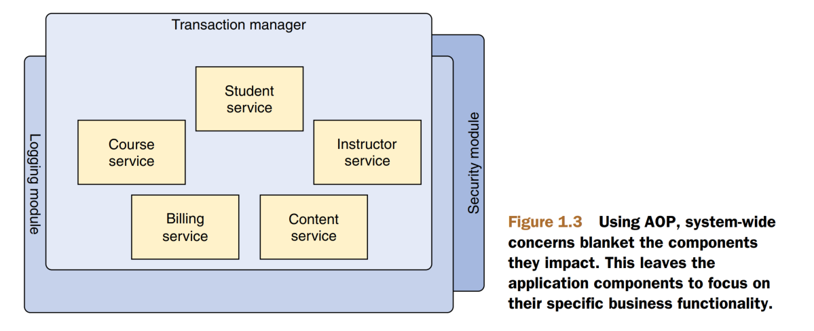

online shopping application: an order management component may need to work with a product manager component and a 
credit card authorization component. All of thse will likely need to work with a data access component to read from 
and write to a database.

inventory: an inventory service (for fetching inventory levels) and a product service (for providing basic product information). The product service depends on the
inventory service to be able to provide a complete set of information about products

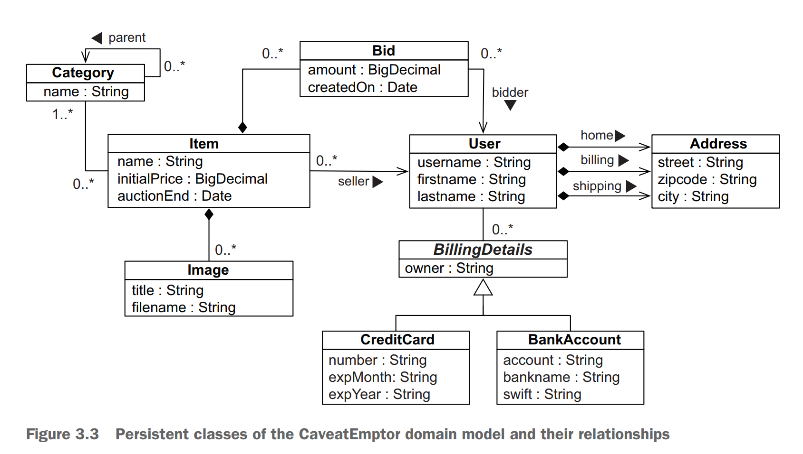

. The role of the engineer is to make the connection
between the application domain, which is the environment of the problem that the system needs to address, and the solution domain, which is the software and the technologies that will build this system. In figure 5.1, the application domain is represented by
the application domain model (the real entities), while the solution domain is represented by the system model (the objects from the software application)
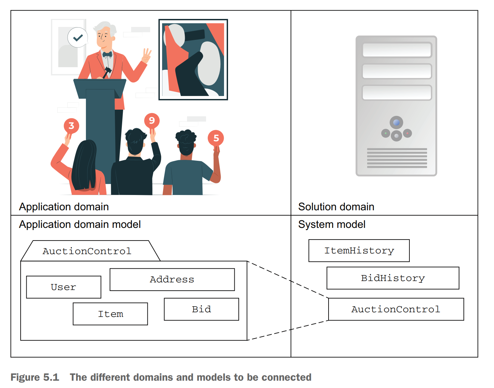
### Command 

00_junit

Compile:

```shell
mkdir target

javac -cp .\junit-4.13.2.jar -d target .\FirstUnitTest.java

java -cp ".\hamcrest-core-1.3.jar;.\junit-4.13.2.jar;.\target" org.junit.runner.JUnitCore FirstUnitTest
```

01_get-started

```shell
mkdir target

javac -cp ".\dependencies\*;." -d .\target\ *.java

java -cp ".\dependencies\*;.\target;." KnightMain

# build jar
jar  -cvf context-test.jar -C .\target .

java -cp ".\dependencies\*;.;.\context-test.jar" KnightMain

```

02_wring-bean

```shell
javac -cp ".\dependencies\*" -d target .\soundsystem\*.java

java -cp ".\dependencies\*;.\target" org.junit.runner.JUnitCore soundsystem.CDPlayerTest
```

03_spring-mvc
```shell
javac -cp .\dependencies\* -d target .\com\uzuhint\web\*.java
java -cp ".\dependencies\*;.\target" org.junit.runner.JUnitCore com.uzuhint.web.HomeControllerTest
```